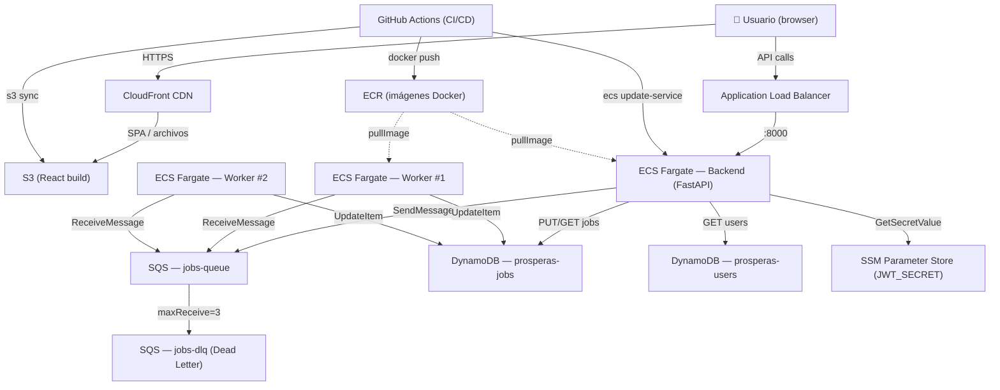
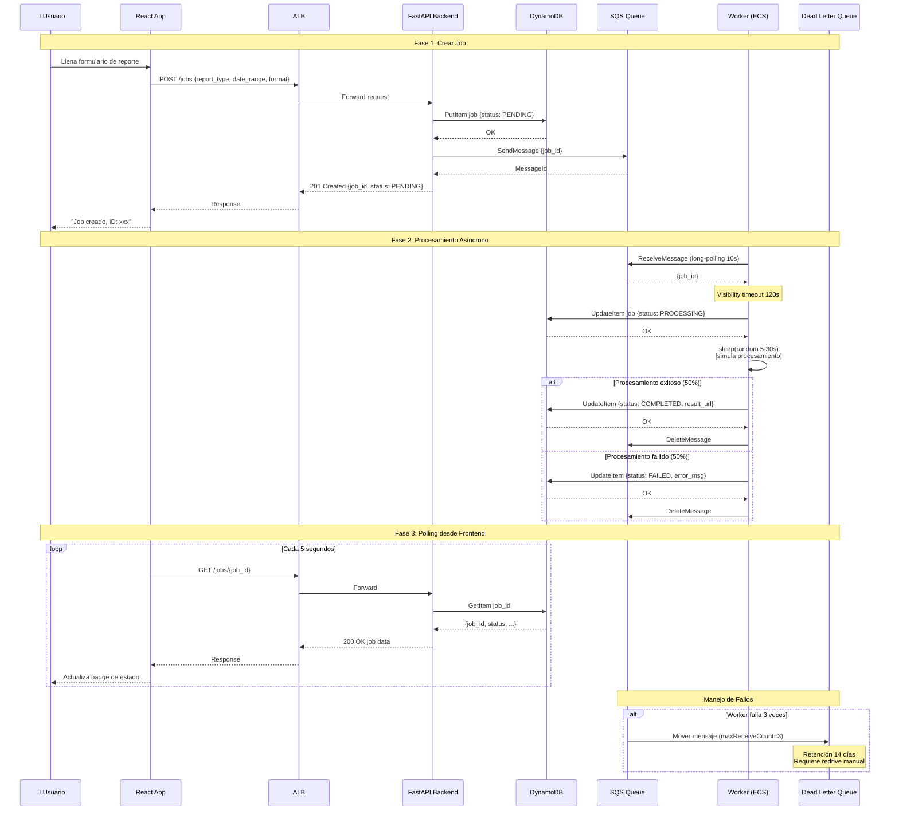

# TECHNICAL_DOCS.md — Sistema de Procesamiento Asíncrono de Reportes

> Generado con GitHub Copilot a partir del código del proyecto. Revisado y ajustado manualmente.

---

## 1. Resumen del sistema

El sistema permite a usuarios autenticados solicitar **reportes de datos bajo demanda**. Como el procesamiento puede tardar entre 5 y 30 segundos, el flujo es completamente asíncrono:

1. El usuario envía un formulario desde React → FastAPI crea el job en DynamoDB y publica un mensaje en SQS.
2. Los workers (en contenedores ECS separados) consumen la cola y actualizan el estado del job.
3. React hace polling cada 5 segundos y muestra el estado en tiempo real con badges de color.

---

## 2. Diagrama de arquitectura



---

## 3. Servicios AWS utilizados

| Servicio | Rol en el sistema | Por qué se eligió |
|---|---|---|
| **SQS** | Cola de mensajes entre API y workers | Servicio gestionado, precio por mensaje, DLQ nativa, reintentos automáticos. Kafka sería sobre-ingeniería para este volumen. |
| **DynamoDB** | Persistencia de jobs y usuarios | Sin servidor, pago por uso, latencia sub-milisegundo en lecturas por PK. El GSI `UserIdIndex` permite listar jobs por usuario eficientemente. RDS requeriría una VPC más elaborada y coste fijo. |
| **ECS Fargate** | Hosting de backend y workers | Sin gestión de EC2, auto-scaling por tarea, aislamiento real entre backend y workers. EC2 era opción pero Fargate es más adecuado para cargas variables. |
| **ALB** | Entrada HTTP al backend | Health checks automáticos, terminación SSL (cuando se añada ACM). Target group tipo IP para Fargate. |
| **ECR** | Registro de imágenes Docker | Integración nativa con ECS sin credenciales extras. Lifecycle policy para limpiar imágenes antiguas. |
| **S3** | Hosting del frontend (archivos estáticos) | Sin servidor, coste casi cero para archivos < 1 GB, integración nativa con CloudFront. |
| **CloudFront** | CDN del frontend | Caché global, HTTPS automático con certificado AWS, SPA routing (404 → index.html). |
| **SSM Parameter Store** | Secreto JWT | SecureString cifrado con KMS. Evita guardar secretos en variables de entorno del contenedor en texto plano. |

---

## 4. Modelo de datos

### Tabla `prosperas-jobs`

| Atributo | Tipo | Descripción |
|---|---|---|
| `job_id` | String (UUID) | PK — identificador único del job |
| `user_id` | String | Usuario que creó el job (GSI: UserIdIndex) |
| `status` | String | `PENDING` / `PROCESSING` / `COMPLETED` / `FAILED` |
| `report_type` | String | Tipo de reporte solicitado |
| `date_range` | String | Rango de fechas (opcional) |
| `format` | String | Formato salida (PDF, CSV, etc.) |
| `created_at` | String (ISO8601) | Timestamp de creación |
| `updated_at` | String (ISO8601) | Última actualización de estado |
| `result_url` | String | URL del resultado (sólo en COMPLETED) |
| `error_msg` | String | Mensaje de error (sólo en FAILED) |

**GSI:** `UserIdIndex` — PK: `user_id`, SK: `created_at` — permite listar jobs de un usuario sin scan.

### Tabla `prosperas-users`

| Atributo | Tipo | Descripción |
|---|---|---|
| `user_id` | String | PK — nombre de usuario |
| `password_hash` | String | bcrypt hash |
| `role` | String | `user` (extensible a `admin`) |

---

## 5. Flujo completo de un job



---

## 6. Decisiones de diseño y trade-offs

| Decisión | Alternativa descartada | Razón |
|---|---|---|
| DynamoDB en lugar de RDS | PostgreSQL (RDS) | Sin VPC compleja, sin coste fijo, pago por lectura/escritura. Para un CRUD de jobs es suficiente. |
| Polling en frontend (5s) | WebSockets / SSE | Más simple y robusto. Evita gestión de conexiones persistentes en Fargate. WebSockets se puede añadir como mejora posterior. |
| ECS Fargate desired_count=2 para workers | 1 worker o Lambda | 2 workers garantizan procesamiento paralelo (requisito). Lambda tendría cold starts y límite de 15 min. |
| SQS visibility_timeout=120s | Valor por defecto (30s) | El job puede tardar hasta 30s + overhead → 120s evita que otro worker reintente un job ya en proceso. |
| JWT en SSM SecureString | Variable de entorno | Los env vars de ECS se pueden leer en AWS Console. SSM cifra con KMS y audita el acceso. |
| Terraform para IaC | CDK / SAM / CloudFormation | Terraform tiene soporte maduro para todos los recursos usados, plan/apply es más predecible. |

---

## 7. Setup local (LocalStack)

### Prerequisitos

- Docker Desktop instalado y corriendo
- `docker compose` v2

**Nota:** No necesitas instalar LocalStack por separado. Viene como servicio en el `docker-compose.yml` (imagen `localstack/localstack:3.0`) y se levanta automáticamente junto con backend, workers y frontend.

### Pasos

```bash
# 1. Clonar el repo
git clone https://github.com/carmagedon07/test_Prosperas.git
cd test_Prosperas

# 2. Copiar variables de entorno
cp .env.example .env
# Editar .env si es necesario (los valores por defecto funcionan para local)

# 3. Ir a la carpeta local/ y levantar todos los servicios
cd local
docker compose up --build

# La primera vez tarda ~2 minutos mientras construye las imágenes y
# LocalStack inicializa los recursos (SQS + DynamoDB).

# 4. Acceder a la app (desde otra terminal, dejar docker compose corriendo)
#   Frontend:  http://localhost:3000
#   Backend:   http://localhost:8000
#   API Docs:  http://localhost:8000/docs
#   LocalStack: http://localhost:4566

# 5. Crear un usuario
curl -X POST http://localhost:8000/auth/register \
  -H "Content-Type: application/json" \
  -d '{"user_id": "testuser", "password": "pass1234"}'

# 6. Hacer login
curl -X POST http://localhost:8000/auth/login \
  -H "Content-Type: application/json" \
  -d '{"user_id": "testuser", "password": "pass1234"}'
# → guarda el token recibido

# 7. Crear un job
curl -X POST http://localhost:8000/jobs \
  -H "Authorization: Bearer <TOKEN>" \
  -H "Content-Type: application/json" \
  -d '{"report_type": "sales", "date_range": "2024-01", "format": "PDF"}'
```

### Servicios del docker-compose

| Servicio | Puerto | Descripción |
|---|---|---|
| `localstack` | 4566 | Emula SQS + DynamoDB |
| `init-aws` | — | Script que crea la tabla DynamoDB y cola SQS al arrancar |
| `backend` | 8000 | FastAPI |
| `worker` | — | SQS Worker (instancia 1) |
| `worker2` | — | SQS Worker (instancia 2) |
| `frontend` | 3000 | React |

---

## 8. Despliegue a producción

### Infraestructura (Terraform — carpeta `infra/`)

```bash
cd infra
cp terraform.tfvars.example terraform.tfvars
# Editar terraform.tfvars con: jwt_secret y (opcional) image_tag

terraform init
terraform plan
terraform apply   # crea todos los recursos AWS (~3 min)

# Al finalizar, anota los outputs:
terraform output backend_url            # URL del ALB
terraform output cloudfront_url         # URL del frontend
terraform output ecr_backend_url        # Para primer push manual
terraform output -json cicd_secret_access_key  # Para GitHub Secrets
```

### GitHub Secrets requeridos

Después de `terraform apply`, configura estos secrets en el repositorio GitHub:

| Secret | Valor |
|---|---|
| `AWS_ACCESS_KEY_ID` | `terraform output cicd_access_key_id` |
| `AWS_SECRET_ACCESS_KEY` | `terraform output -json cicd_secret_access_key` |
| `ECR_BACKEND_REPO` | `terraform output ecr_backend_url` |
| `ECR_WORKER_REPO` | `terraform output ecr_worker_url` |
| `REACT_APP_API_URL` | `http://<terraform output backend_url>` |
| `S3_BUCKET` | `terraform output s3_frontend_bucket` |
| `CLOUDFRONT_DISTRIBUTION_ID` | `terraform output cloudfront_distribution_id` |

### Pipeline CI/CD (GitHub Actions — `.github/workflows/deploy.yml`)

```
push a main
    │
    ├─ [test]        → pytest del backend
    ├─ [build-push]  → build backend + worker Docker → push a ECR
    ├─ [deploy-ecs]  → aws ecs update-service (backend + worker) → wait stable
    └─ [deploy-fe]   → npm run build → s3 sync → CloudFront invalidation
```

---

## 9. Variables de entorno

| Variable | Descripción | Valor local | Valor producción |
|---|---|---|---|
| `AWS_REGION` | Región AWS | `us-east-1` | `us-east-1` |
| `AWS_ACCESS_KEY_ID` | Credencial AWS | `test` (localstack) | IAM CI/CD user key |
| `AWS_SECRET_ACCESS_KEY` | Credencial AWS | `test` (localstack) | IAM CI/CD user secret |
| `DYNAMODB_ENDPOINT` | Override endpoint DynamoDB | `http://localstack:4566` | *(vacío → AWS real)* |
| `SQS_ENDPOINT` | Override endpoint SQS | `http://localstack:4566` | *(vacío → AWS real)* |
| `JOBS_TABLE_NAME` | Tabla DynamoDB de jobs | `jobs` | `prosperas-jobs` |
| `USERS_TABLE_NAME` | Tabla DynamoDB de usuarios | `users` | `prosperas-users` |
| `SQS_QUEUE_NAME` | Nombre de la cola SQS | `jobs-queue` | `prosperas-jobs-queue` |
| `SQS_QUEUE_URL` | URL completa de SQS (opcional) | Construida dinámicamente | Construida con `get_queue_url` |
| `JWT_SECRET` | Secreto para firmar JWT | `secret_local` | Leído de SSM en ECS |
| `JWT_EXPIRY_MINUTES` | Vida útil del token (minutos) | `60` | `60` |
| `REACT_APP_API_URL` | URL base del backend | `http://localhost:8000` | URL del ALB |

---

## 10. Tests

```bash
# Desde la raíz del proyecto
cd backend
pip install -r requirements.txt
python -m pytest tests/ -v

# Suites disponibles:
# tests/application/use_cases/test_create_job.py       → crea job con mock repository
# tests/application/use_cases/test_get_job.py          → obtiene job existente / 404
# tests/application/use_cases/test_job_use_cases.py    → casos borde (jobs vacíos, paginación)
# tests/application/use_cases/test_update_job_status.py → transiciones de estado
```

Los tests usan repositorios mock en memoria — no requieren DynamoDB ni LocalStack.
